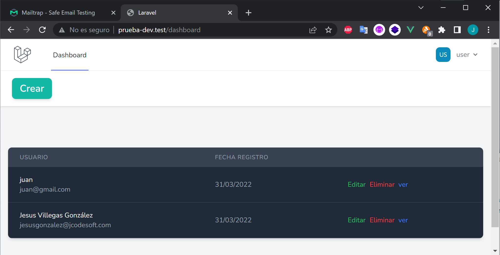

<h1 align="center" id="title">Prueba dev</h1>


<p id="description">Aplicación de Laravel para la gestión de usuarios (CRUD básico).<br>Datos necesarios para la ejecución:<br></p>

<h2>🛠️ Installation Steps:</h2>

<p>1. Instalar las dependecias de composer:</p>

```
composer install & php artisan migrate
```

<p>2. Instalar las dependecias de npm:</p>

```
npm i
```

<p>3. Configurar .env para usar mailtrap para envio de correos en desarrollo:</p>

```
MAIL_MAILER=smtp
MAIL_HOST=smtp.mailtrap.io
MAIL_PORT=2525
MAIL_USERNAME=81dasdfc0ff4d44
MAIL_PASSWORD=a04e3bdfsdfed7a3
MAIL_ENCRYPTION=null
MAIL_FROM_ADDRESS="demo@prueba-dev.com"
```

<p>3. Para produccion</p>

```
npm run dev
```

<p>4. Configurar el .env para producción</p>

```
APP_DEBUG & APP_ENV
```

<h2>💻 Built with</h2>

Technologies used in the project:

-   Laravel 9
-   vue 3
-   laravel breeze
-   Tailwind CSS
-   SweetAlert
